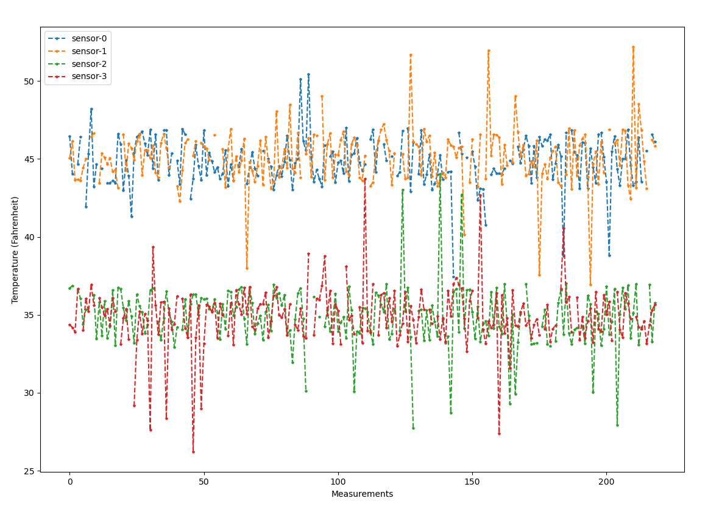

# Project 2, Temperature Sensor System Simulator, 2nd Phase

## Team
* Roberto Baquerizo
* Zach Turner


## Project Summary
* Use NodeJS and SQL to simulate temperature sensors taking measurements and saving to a database
* Update Python Master Controller to read from the database and analyze the data
* Include Python's plottting library `matplot-lib` to graphically display the measurments from all running sensors

## Language and Environment Description
* Python 3.8.5
* node v14.15.4 (npm v6.14.10)
* MySQL ver 14.14 distrib 5.7.32

### Python packages
* mysql-connector-python

### Node packages
These are the packages used by our project and specified by the `package.json` file in the Node project.
* mysql
* @types/mysql
* nodemon (used for development to auto-restart the node application)

### Installing Node.js

1. On a new terminal, execute:
```
curl https://raw.githubusercontent.com/creationix/nvm/v0.37.2/install.sh | bash
```
2. Close and open the terminal
3. In new terminal, execute:
```
NODE_VERSION=14.15.4
nvm install $NODE_VERSION && nvm alias default $NODE_VERSION && nvm use default
```

:information_source: if executing the assignment for the first time, ensure that the required node modules dependencies defined by `package.json` are installed. This can be done through npm by running:

```
npm install
```

#### Example versions

```
zturner@DESKTOP-07LOS04:/mnt/c/grad-school/eid/eid-project-2$ node -v
v14.15.4
zturner@DESKTOP-07LOS04:/mnt/c/grad-school/eid/eid-project-2$ npm -v
6.14.10
zturner@DESKTOP-07LOS04:/mnt/c/grad-school/eid/eid-project-2$ nvm -v
0.37.2
```

### Installing MySQL

Link for reference: [Install MySQL Tutorial](https://medium.com/@alef.duarte/cant-connect-to-local-mysql-server-through-socket-var-run-mysqld-mysqld-sock-155d580f3a06)

The latest version of MySQL is in the APT repository, which makes installing it easy.

```
sudo apt update
sudo apt -y upgrade
sudo apt install -y mysql-server mysql-client
```

To start the local server, run this command:
```
sudo /etc/init.d/mysql start
```

#### Example Version
```
mysql  Ver 14.14 Distrib 5.7.32, for Linux (x86_64) using  EditLine wrapper
```

:information_source: ensure that the MySQL Connector Python package that is used by the master controller is installed before continuing:
```
pip install mysql-connector-python
```

#### Setting up Sensor User
:information_source: Replace `sensor` below with username.
```
$ sudo mysql
mysql> CREATE USER 'sensor'@'localhost' IDENTIFIED BY 'balderdash';
mysql> GRANT ALL PRIVILEGES ON * . * TO 'sensor'@'localhost';
mysql> FLUSH PRIVILEGES;
mysql> quit;
```

This user and password are maintained in the `config.json` file in the project and are simply representational.


#### Configuring Database
The database is configured by the `server.js` when the assignment begins. This is done by a series of SQL commands issues upon connecting to the database.

```javascript
const create_db = "CREATE DATABASE IF NOT EXISTS sensor_db";

    db_connection.query(create_db, function (err, result) {
        if (err) throw err;
        console.log("Database created!");
    });

    db_connection.changeUser({
        database: 'sensor_db'
    }, (err) => {
        if (err) {
            console.log('Error in changing database ', err);
            return;
        }
    });

    const clear_db_table = "DROP TABLE IF EXISTS sensors";
    db_connection.query(clear_db_table, function (err, result) {
        if (err) throw err;
        console.log("Table deleted");
    });

    var create_sensor_table = "CREATE TABLE sensors (id INT AUTO_INCREMENT PRIMARY KEY, sensorId INTEGER(255), timestamp TEXT, temperature REAL, alarm_count INTEGER, error_count INTEGER)";
    db_connection.query(create_sensor_table, function (err, result) {
        if (err) throw err;
        console.log("Table created");
    });

```

### Running Server Code
To start the sensor simulation server, execute:

```
npm start <NUMBER OF SENSORS>
```

## Program Design

### NodeJS Sensors
In a similar design to our first assignment, the sensor code was split between process creation and initialization and the sensor object. After `server.js` does some initial configuration steps like connecting to the database and preparing an SQL table for the sensors, ittakes the command line response for the number of sensors to initialize and fork those processes. 

`sensor.js` is the object-implementation of the sensor, making measurements once every 10 seconds and simulating different events like a temperature spike or the measurement being unavailable. Each process is maintains a unique connection to the database, although all sensors (and the server controller) share the same SQL user. This was chosen for the simplicity in setting up the SQL database, but could be a place of optimization if this assignment was built on.

### Updating Master Controller

### Python Plotting of Sensor Data



## Resources Referenced
* https://www.freecodecamp.org/news/node-js-child-processes-everything-you-need-to-know-e69498fe970a/
* https://www.digitalocean.com/community/tutorials/how-to-create-a-new-user-and-grant-permissions-in-mysql
* https://www.sitepoint.com/using-node-mysql-javascript-client/
* https://stackoverflow.com/questions/22348705/best-way-to-store-db-config-in-node-js-express-app