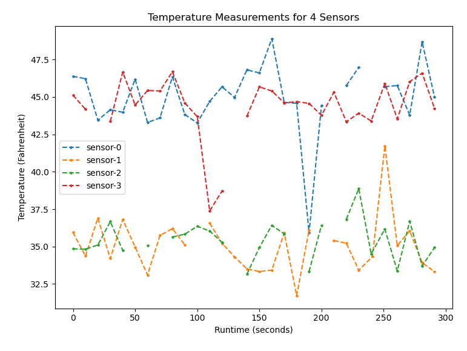

# Project 2, Temperature Sensor System Simulator, 2nd Phase

## Team
* Roberto Baquerizo
* Zach Turner


## Project Summary
* Use NodeJS and SQL to simulate temperature sensors taking measurements and saving to a database
* Update Python Master Controller to read from the database and analyze the data
* Include Python's plottting library `matplot-lib` to graphically display the measurments from all running sensors

## Language and Environment Description
* Python 3.8.5
* node v14.15.4 (npm v6.14.10)
* MySQL ver 14.14 distrib 5.7.32

### Python packages
* numpy 1.19.2
* matplotlib 3.3.2
* json 2.0.9
* pymysql 1.0.2

### Node packages
These are the packages used by our project and specified by the `package.json` file in the Node project.
* mysql
* @types/mysql
* nodemon (used for development to auto-restart the node application)

### Installing Node.js

1. On a new terminal, execute:
```
curl https://raw.githubusercontent.com/creationix/nvm/v0.37.2/install.sh | bash
```
2. Close and open the terminal
3. In new terminal, execute:
```
NODE_VERSION=14.15.4
nvm install $NODE_VERSION && nvm alias default $NODE_VERSION && nvm use default
```

:information_source: if executing the assignment for the first time, ensure that the required node modules dependencies defined by `package.json` are installed. This can be done through npm by running:

```
npm install
```

#### Example versions

```
zturner@DESKTOP-07LOS04:/mnt/c/grad-school/eid/eid-project-2$ node -v
v14.15.4
zturner@DESKTOP-07LOS04:/mnt/c/grad-school/eid/eid-project-2$ npm -v
6.14.10
zturner@DESKTOP-07LOS04:/mnt/c/grad-school/eid/eid-project-2$ nvm -v
0.37.2
```

### Installing MySQL

Link for reference: [Install MySQL Tutorial](https://medium.com/@alef.duarte/cant-connect-to-local-mysql-server-through-socket-var-run-mysqld-mysqld-sock-155d580f3a06)

The latest version of MySQL is in the APT repository, which makes installing it easy.

```
sudo apt update
sudo apt -y upgrade
sudo apt install -y mysql-server mysql-client
```

To start the local server, run this command:
```
sudo /etc/init.d/mysql start
```

#### Example Version
```
mysql  Ver 14.14 Distrib 5.7.32, for Linux (x86_64) using  EditLine wrapper
```

:information_source: ensure that the PyMySQL Python package that is used by the master controller is installed before continuing:
```
pip install --upgrade setuptools wheel
pip install pymysql
```

#### Setting up Sensor User
```
$ sudo mysql
mysql> CREATE USER 'sensor'@'localhost' IDENTIFIED BY 'balderdash';
mysql> GRANT ALL PRIVILEGES ON * . * TO 'sensor'@'localhost';
mysql> FLUSH PRIVILEGES;
mysql> quit;
```

:information_source: The user and password are maintained in configuration file: [`config.json`](code/config.json). The values are simply representational and can be modified.


#### Configuring Database
The database is configured by `server.js` when the assignment begins. This is done by a series of SQL commands issues upon connecting to the database.

```javascript
const create_db = "CREATE DATABASE IF NOT EXISTS sensor_db";

    db_connection.query(create_db, function (err, result) {
        if (err) throw err;
        console.log("Database created!");
    });

    db_connection.changeUser({
        database: 'sensor_db'
    }, (err) => {
        if (err) {
            console.log('Error in changing database ', err);
            return;
        }
    });

    const clear_db_table = "DROP TABLE IF EXISTS sensors";
    db_connection.query(clear_db_table, function (err, result) {
        if (err) throw err;
        console.log("Table deleted");
    });

    var create_sensor_table = "CREATE TABLE sensors (id INT AUTO_INCREMENT PRIMARY KEY, sensorId INTEGER(255), timestamp TEXT, temperature REAL, alarm_count INTEGER, error_count INTEGER)";
    db_connection.query(create_sensor_table, function (err, result) {
        if (err) throw err;
        console.log("Table created");
    });

```

### Running Server Code
To start the sensor simulation server, execute:

```
cd code
npm start <NUMBER OF SENSORS>
```

### Running Master Controller
To start the master controller monitoring the simulated sensors, execute:

```
cd code
python master_controller.py
```

:information_source: The controller program does not accept any command-line arguments. The program assumes that **four** sensors are being actively simulated.

## Program Design

### NodeJS Sensors
In a similar design to our first assignment, the sensor code was split between process creation and initialization and the sensor object. After `server.js` does some initial configuration steps like connecting to the database and preparing an SQL table for the sensors, ittakes the command line response for the number of sensors to initialize and fork those processes.

`sensor.js` is the object-implementation of the sensor, making measurements once every 10 seconds and simulating different events like a temperature spike or the measurement being unavailable. Each process is maintains a unique connection to the database, although all sensors (and the server controller) share the same SQL user. This was chosen for the simplicity in setting up the SQL database, but could be a place of optimization if this assignment was built on.

As the sensors continue to take measurements, in addition to storing to the database messages are also returned to the parent process. This is primarily used for logging of the sensor data, but could be expanded upon for error handling of the running child processes. We chose not to log to a file and instead log these messages to the console log for ease of development.

```javascript
Message from child 1 {
  id_num: 1,
  date: '2/2/2021, 6:41:49 AM',
  temp: 43.95835505086154,
  alarms: 1,
  errors: 1
}
Message from child 0 {
  id_num: 0,
  date: '2/2/2021, 6:41:49 AM',
  temp: 999,
  alarms: 0,
  errors: 2
}
Message from child 2 {
  id_num: 2,
  date: '2/2/2021, 6:41:49 AM',
  temp: 34.00243238966721,
  alarms: 1,
  errors: 2
}
Message from child 3 {
  id_num: 3,
  date: '2/2/2021, 6:41:49 AM',
  temp: 46.73114138797115,
  alarms: 0,
  errors: 1
}
...

```

### Updating Master Controller
The Master Controller underwent some modifications required to interface with the SQL database containing the simulated sensor data.
We used the `PyMySQL` python package to interface with MySQL, and used [5] as a reference for how to use the API.


Instead of opening and reading in sensor data from text files every 30 seconds, the master controller connects to the SQL database, fetching all measurements currently existing in the database, and storing the fetched data in an instance variable of the master controller object.After that, the master performs similar computations on the sensor data as it did in the previous assignment. The master filters the instance variable containing the data from the SQL database to pick out the the measurements for each of the four simulated sensors. Following that, average, maximum and minimum temperatures in Fahrenheit and Celsius are calculated. Like before, the master determines the average, maximum, and mimimum temperatures based on the last ten measurements, or fewer if ten are not available, for each sensor. This information, along with the alarm and error counts for each sensor are printed in json format to a log file ([master.json](artifacts/master.json)) as well as simple text to the terminal.

The text printed to the terminal by the master controller program was saved to [master_terminal_output.txt](artifacts/master_terminal_output.txt) in the artifacts directory. The beginning of that text is reproduced below:
```
baquerrj@karachi:~/boulder/Embedded-Interface-Design-ECEN5783/eid-project-2/code
python master_controller.py
Checking database...
No data yet...
Checking database...
Sensor Number:0. Timestamp:2021-02-02 19:47:18.196689. Max Temperature F:46.37139667900322. Min Temperature F:43.4485747014364. Mean Temperature F:45.34651619168716. Max Temperature C:7.9841092661129. Min Temperature C:6.360319278575777. Mean Temperature C:7.414731217603976. Alarm Count:0. Error Count:0.
Sensor Number:1. Timestamp:2021-02-02 19:47:18.196977. Max Temperature F:36.904660162864886. Min Temperature F:34.36693846310822. Mean Temperature F:35.738635419613416. Max Temperature C:2.7248112015916033. Min Temperature C:1.3149658128378998. Mean Temperature C:2.077019677563009. Alarm Count:0. Error Count:0.
Sensor Number:2. Timestamp:2021-02-02 19:47:18.197336. Max Temperature F:35.10885724992044. Min Temperature F:34.8248885287311. Mean Temperature F:34.92823698120017. Max Temperature C:1.7271429166224668. Min Temperature C:1.569382515961723. Mean Temperature C:1.6267983228889844. Alarm Count:0. Error Count:0.
ERROR[1]: invalid temperature for sensor-3
ERROR[2]: invalid temperature for sensor-3
Sensor Number:3. Timestamp:2021-02-02 19:47:18.197665. Max Temperature F:45.11395052957336. Min Temperature F:44.17593929211725. Mean Temperature F:44.644944910845304. Max Temperature C:7.285528071985199. Min Temperature C:6.7644107178429165. Mean Temperature C:7.0249693949140575. Alarm Count:0. Error Count:1.
Checking database...
Sensor Number:0. Timestamp:2021-02-02 19:47:48.251474. Max Temperature F:46.37139667900322. Min Temperature F:43.4485747014364. Mean Temperature F:44.809586629059105. Max Temperature C:7.9841092661129. Min Temperature C:6.360319278575777. Mean Temperature C:7.116437016143948. Alarm Count:0. Error Count:0.
Sensor Number:1. Timestamp:2021-02-02 19:47:48.252322. Max Temperature F:36.904660162864886. Min Temperature F:34.20299010846451. Mean Temperature F:35.60886373119093. Max Temperature C:2.7248112015916033. Min Temperature C:1.2238833935913955. Mean Temperature C:2.004924295106072. Alarm Count:0. Error Count:0.
ERROR[3]: invalid temperature for sensor-2
ERROR[4]: invalid temperature for sensor-2
Sensor Number:2. Timestamp:2021-02-02 19:47:48.252800. Max Temperature F:36.672153249614084. Min Temperature F:34.751418171606915. Mean Temperature F:35.31661869843148. Max Temperature C:2.5956406942300467. Min Temperature C:1.5285656508927303. Mean Temperature C:1.8425659435730464. Alarm Count:0. Error Count:1.
ERROR[5]: invalid temperature for sensor-3
ERROR[6]: invalid temperature for sensor-3
```

The first couple of entries to the master.json file are also shown below:
```json
{
  "measurements": [
    {
      "Sensor Number": 0,
      "Timestamp": "2021-02-02 19:47:18.196689",
      "Max Temperature F": 46.37139667900322,
      "Min Temperature F": 43.4485747014364,
      "Mean Temperature F": 45.34651619168716,
      "Max Temperature C": 7.9841092661129,
      "Min Temperature C": 6.360319278575777,
      "Mean Temperature C": 7.414731217603976,
      "Alarm Count": 0,
      "Error Count": 0
    },
    {
      "Sensor Number": 1,
      "Timestamp": "2021-02-02 19:47:18.196977",
      "Max Temperature F": 36.904660162864886,
      "Min Temperature F": 34.36693846310822,
      "Mean Temperature F": 35.738635419613416,
      "Max Temperature C": 2.7248112015916033,
      "Min Temperature C": 1.3149658128378998,
      "Mean Temperature C": 2.077019677563009,
      "Alarm Count": 0,
      "Error Count": 0
    },
    {
      "Sensor Number": 2,
      "Timestamp": "2021-02-02 19:47:18.197336",
      "Max Temperature F": 35.10885724992044,
      "Min Temperature F": 34.8248885287311,
      "Mean Temperature F": 34.92823698120017,
      "Max Temperature C": 1.7271429166224668,
      "Min Temperature C": 1.569382515961723,
      "Mean Temperature C": 1.6267983228889844,
      "Alarm Count": 0,
      "Error Count": 0
    },
    {
      "Sensor Number": 3,
      "Timestamp": "2021-02-02 19:47:18.197665",
      "Max Temperature F": 45.11395052957336,
      "Min Temperature F": 44.17593929211725,
      "Mean Temperature F": 44.644944910845304,
      "Max Temperature C": 7.285528071985199,
      "Min Temperature C": 6.7644107178429165,
      "Mean Temperature C": 7.0249693949140575,
      "Alarm Count": 0,
      "Error Count": 1
    },
```


### Python Plotting of Sensor Data
To quit running the Master Controller, the user can use Ctrl-C. Before exiting, the master displays a plot of the temperature readings of each sensor before exiting. The program plots temperature in Fahrenheit versus time, where `0` seconds corresponds to the start of the program.



## Resources Referenced
* https://www.freecodecamp.org/news/node-js-child-processes-everything-you-need-to-know-e69498fe970a/
* https://www.digitalocean.com/community/tutorials/how-to-create-a-new-user-and-grant-permissions-in-mysql
* https://www.sitepoint.com/using-node-mysql-javascript-client/
* https://stackoverflow.com/questions/22348705/best-way-to-store-db-config-in-node-js-express-app
* https://zetcode.com/python/pymysql/


[1]: <https://www.freecodecamp.org/news/node-js-child-processes-everything-you-need-to-know-e69498fe970a/> (ref1)
[2]: <https://www.digitalocean.com/community/tutorials/how-to-create-a-new-user-and-grant-permissions-in-mysql> (ref2)
[3]: <https://www.sitepoint.com/using-node-mysql-javascript-client/> (ref3)
[4]: <https://stackoverflow.com/questions/22348705/best-way-to-store-db-config-in-node-js-express-app> (ref4)
[5]: <https://zetcode.com/python/pymysql/> (ref5)